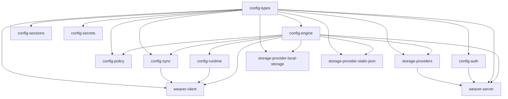

# Package Dependency Graph

## Overview

Weaver follows a strict upward dependency flow. Leaf packages have zero internal dependencies, composite packages depend only on packages below them.

## Graph

## Layer Summary

| Layer | Packages |
|-------|----------|
| **Leaf** (zero internal deps) | `config-types` |
| **Core utilities** | `config-engine` |
| **Domain** | `config-auth`, `config-sessions`, `config-secrets`, `config-policy`, `config-runtime`, `config-sync` |
| **Storage** | `storage-providers`, `storage-provider-local-storage`, `storage-provider-static-json` |
| **Consumer** (top-level) | `weaver-client`, `weaver-server` |

## Rules

1. Dependencies flow **upward** (leaf → composite)
2. No circular dependencies
3. `config-types` is the universal leaf — everything can depend on it
4. `config-engine` provides utilities used by both client and server
5. `weaver-client` and `weaver-server` are the top-level consumer packages
